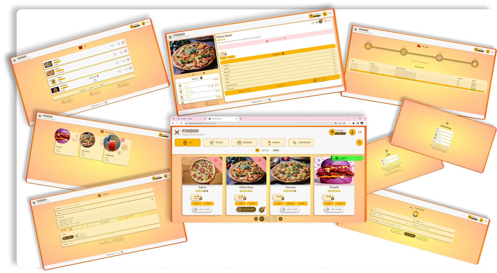
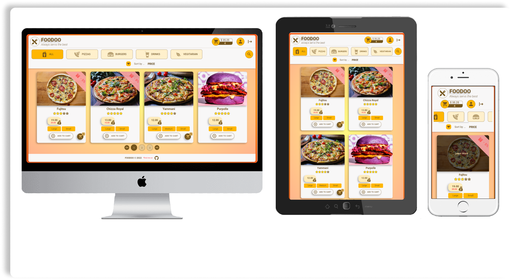

# _Project_ : FooDoo shop ( E-commerce )

_See project live :_ **[FooDoo-shop.com](https://apaltrow.github.io/foodoo-shop/#/)**

---

 **Attention!**

_`Application contains a registration stage, however, there is`_ **`a demo account available`** _`for your convenience!`_

## Access the demo account :

- At the login page click the **`'LOGIN WITH DEMO ACCOUNT'`** button

## About

_Online food store aimed to satisfy E-commerce business & customer's needs
with full cycle of customer's jorney starting from account creation and ending up with final order receipt._

_Adaptive and responsive design makes the application available on various devices such as desktop PCs, laptops, tablets and mobile phones._

_Intuitive and user friendly interface delivers the best UX._

## Tech Stack

| Side             | Tech                     | Icon                                      |
| ---------------- | ------------------------ | ----------------------------------------- |
| Front End        | React                    |    |
| Styles           | Sass / Scss _(modules)_  |     |
| State management | Redux / Tool Kit         |    |
| Server requests  | Axios / Redux AsyncThunk |   |
| Version control  | Git                      |      |
| Back End         | MockApi                  |  |
| Deployment       | Github Pages             |   |
| Design           | Figma                    |    |

## Detailed Overview

---

1.  _Authentication_ : **`Registration`**, **`Login`** pages.

---

- Forms validations _(with custom hooks)_

- Authentication check _(public and private routes with React Router + custom Auth HOC)_

- Login memory with local storage _(ability to use within multiple tabs)_

- Log out option _(with further re-authentication)_

- Demo account available.

## 

## 

2.  _Mane_ : **`Home`** page.

---

- Navigation pannel with:

  - `Category sort`
  - `Sort by` _\*price_ _\*title_ _\*rating_
  - `Order sort` _\*ascending_ _\*descending_
  - `Input search `

- Catalog of the dish cards

- Single dish card with the ability to choose the size of the product and add to cart

- Dynamic indicator of the amount of the product added to the cart

- Product image contains a` link to Single Product page`

- Notification toast _( informing about successful addition )_

- Discount informer with percentage and discount price visualization

- Dynamic `Paggination`

## 

---

3.  **`Single Product`** page.

---

- Adaptive `slider` for product photos visualization with dynamic paggination

## 

- `Product Reviews` section with user's rating and comment
  - Contains details about commenter and date
  - Has the ability to delete or edit previous comment _(in case you are the owner)_
- `Rate this product` functionality

  - Allows to rate and comment the product
  - Feedback will be recorded and saved to the Review section.

## 

- Side menu contains informers about the product _( ex. Vegitarian friendly , Allergic sensitive notifiers )_

- `Ingredients overview` section

  - Dynamic weight indication for each size separately.
  - `Special order` option - provides the ability to customize the order _( exclude ingredients )_

## 

- `Add to Favourites` option, allows to add the product of specific size and/or special order indication to your personal favourites list

## 

---

4.  **`Profile Settings`** page.

---

## 

- Update / change the Delivery Address.

## 

- Edit the profile information _( first, last name, phone number )_

## 

- Change password

---

5.  **`My Favourites`** page.

---

- Contains the list of the products _( of specific size or special order )_ for quick shopping

- Ability to quickly add the product to the cart

- Abiity to delete the product from your list

- Ability to navigate to the Single Product page

## 

---

6.  **`Cart`** page.

---

`Cart Page - consists of 2 sections : Cart and Checkout`

- Cart :

  - Contains the catalog of the added products with information about the sizes, prices and type of the products as well as the special orders _( if applied )_

  - Side menu gives the ability to `increase / decrease` the amount and/ or `delete a specific product`.

  - Totals section contains` info` about the `total amount and cost` as well as the `discount saved` _( if applied )_

## 

- Checkout :

  - `Confirmation form` with the details about the recipient, delivery address, order check and total due.

  - `Pre-order section` : _( if applied )_ gives the ability to pick the pre-order date and time and `arrange a delayed delivery` _( contains `custom selects + calendar` )_

  - `Payment section `: provides the opportunity to pick if the order is payed with cash on delivery or straight away with card.

  - Card payment contains the form for (\*Mock ) payment processing by entering the card details.

  - Once the order is submitted, it is recorded and forwarded to _'My Orders page'_ automatically

## 

---

7.  **`My Orders`** page.

---

- Contains Recent orders section with the `overview of the previous orders` as well as the `current pending orders`

- Provides the ability to track the orders and find the details, see the status of the order

- My Orders section contains the `order processing widget` with animated status tracking if there is a pending order _( is not applied for pre-orders )_

## 

## 

## 
